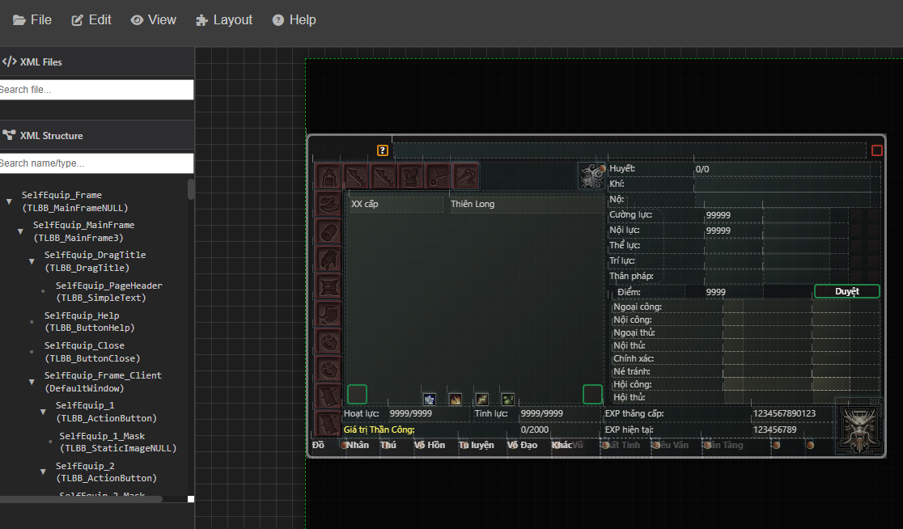
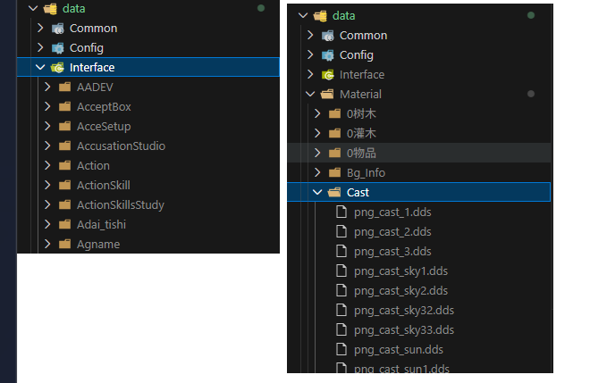

# https://trickgame24h.blogspot.com/ ShARE TLBB GUI Web Renderer

Ứng dụng web để render và chỉnh sửa file XML giao diện của game Thiên Long Bát Bộ (TLBB) thành HTML/CSS/JavaScript.

## 1/📂Bổ sung Cấu trúc thư mục game của các bạn
✨data\Config\StrDic.txt chứa từ điển chuỗi giao diện.
✨data\Interface chứa các file XML giao diện mẫu từ game.
✨data\Material chứa các tài nguyên hình ảnh liên quan.

## 2 Khởi chạy ứng dụng web:
Mở file `index.html` trong trình duyệt web hiện đại (Chrome, Firefox, Edge).
hoặc dùng vs code chạy live server.

## ✨ Tính năng chính

### 🎯 Core Features
- **XML Rendering**: Chuyển đổi XML layout TLBB thành HTML interactive
- **Real-time Editing**: Resize và move elements với cập nhật properties tự động
- **Property Management**: Edit và save properties với format TLBB chuẩn
- **XML Export**: Copy XML to clipboard với format đúng chuẩn game
- **Visual Editor**: Drag & drop, resize handles, snap-to-grid

### 🎨 Enhanced GUI
- **3-Panel Layout**: XML Tree - Canvas - Properties Panel
- **Interactive Canvas**: Zoom, pan, select, transform elements
- **Property Panel**: Real-time property editing với validation
- **Dark Theme**: Professional dark interface
- **Transform Tools**: Move, resize, rotation với visual feedback
- **Hierarchy Visualization**: Màu viền khác nhau cho từng cấp độ phân cấp
- **Debug Mode**: Hiển thị level numbers để debug hierarchy

### 📊 TLBB Format Support
- **UnifiedPosition/Size**: Format `{{rel,abs},{rel,abs}}` với 6 decimal precision
- **Property Validation**: Kiểm tra format TLBB properties
- **Bidirectional Sync**: Properties ↔ Bounds synchronization
- **Legacy Support**: AbsolutePosition/Size fallback

## 🔧 Technical Features

### Real-time Property Updates
- Resize elements → auto update UnifiedPosition/Size
- Edit properties → auto apply to visual bounds  
- Save properties → persist to XML và localStorage
- Format validation với error messages

### Advanced XML Processing
- Smart XML parsing với error handling
- Clean XML generation (no test elements)
- Version history trong localStorage
- Undo/redo capability

## 🚀 Cách sử dụng

### Cơ bản
1. **Load XML**: Mở file .xml hoặc paste XML content
2. **Select Element**: Click element trong canvas hoặc tree
3. **Edit Properties**: Thay đổi values trong Properties Panel
4. **Transform Visual**: Drag để move, resize handles để thay đổi size
5. **Save Changes**: Click "Lưu" để persist properties
6. **Export XML**: Copy XML to clipboard với format chuẩn

### Tính năng nâng cao
- **Hierarchy Debug**: View → Debug Hierarchy Levels để xem mức độ phân cấp
- **Visual Indicators**: 
  - Icon ▼ cho elements có children
  - Số children hiển thị ở góc phải dưới
  - Màu viền khác nhau cho từng level (đỏ=root, xanh=level 1, etc.)
- **Multi-level Selection**: Click element để chọn, hierarchy được highlight

## 🛠️ Cấu trúc module

```
tlbb_web_ui/
├── index.html                 # Main application file
├── css/                       # Stylesheets
│   ├── main.css              # Core styles
│   └── property-panel.css    # Property panel styles
├── js/                       # JavaScript modules
│   ├── main.js               # Main application class với tất cả features
│   └── utils/                # Utility modules
│       └── *.js              # Parser, renderer, calculator utilities
└── data/                     # Test data và resources
```

## 📝 Implementation Notes

### Key Functions Implemented

#### 1. **_updateElementPropertiesFromBounds(element)**
- Sync element bounds → TLBB properties format
- Tự động update UnifiedPosition/Size khi resize
- Format chuẩn: `{{relative,absolute},{relative,absolute}}`

#### 2. **_applyPropertiesToBounds(element)** 
- Sync TLBB properties → element bounds
- Parse UnifiedPosition/Size và apply to visual bounds
- Fallback support cho AbsolutePosition/Size

#### 3. **_handleSaveButton(panel, element)**
- Enhanced save với progress feedback
- Property validation và error handling  
- Auto re-render khi position/size properties change
- History tracking và localStorage persistence

#### 4. **generateXMLFromElements(elements)**
- Clean XML export với TLBB format chuẩn
- Exclude test elements và invalid properties
- Copy to clipboard functionality

### Property Format Support
- ✅ UnifiedPosition: `{{0.150000,150.000000},{0.200000,200.000000}}`
- ✅ UnifiedSize: `{{0.350000,350.000000},{0.180000,180.000000}}`
- ✅ AbsolutePosition: `{100.000000,150.000000}` (fallback)
- ✅ AbsoluteSize: `{200.000000,100.000000}` (fallback)
- ✅ 6 decimal precision cho tất cả numeric values

## 🎯 Usage Guide

## 🎯 Usage Guide

### 1. Quick Start
- Open `index.html` in modern web browser
- Load XML file or paste XML content
- Select elements to edit properties
- Use drag & resize for visual editing
- Copy XML result to clipboard

### 2. Key Workflows

#### Edit Properties → Visual Update
1. Select element in canvas/tree
2. Edit properties in right panel  
3. Click "Lưu" to save changes
4. Visual bounds update automatically

#### Visual Transform → Properties Update  
1. Select element in canvas
2. Drag to move OR use resize handles
3. Properties panel updates với TLBB format
4. Click "Lưu" to persist changes

#### Export Clean XML
1. Make all desired changes
2. Click "Copy XML to Clipboard"
3. Paste result vào TLBB game files

## 💡 Tips & Best Practices

- **Property Format**: Always use TLBB format `{{rel,abs},{rel,abs}}`
- **Precision**: 6 decimal places cho numeric values
- **Validation**: Check property warnings (❌/✅) before save
- **History**: Use Ctrl+Z/Ctrl+Y for undo/redo
- **Performance**: Avoid too many elements on canvas simultaneously

## 🔧 Advanced Features

- **Layout Calculator**: Auto-compute positions based on parent bounds
- **Property Validation**: Real-time format checking
- **Version History**: Automatic save states in localStorage  
- **Transform Protection**: Prevent accidental style mutations
- **Background Tasks**: Non-blocking XML processing

---

**Created for TLBB GUI Development** | **Updated: September 2025**
| Ctrl + 0 | Reset zoom 100% |
| Ctrl + 1 | Fit to canvas |
| Ctrl + 2 | Fit to content |
| Ctrl + +/- | Zoom in/out |
| Del | Xóa element đã chọn |
| Esc | Hủy thao tác |

## Các loại Element được hỗ trợ

### 🪟 Window & Frame
- `DefaultWindow` - Cửa sổ chính
- `FrameWindow` - Khung cửa sổ
- `StaticFrame` - Khung tĩnh
- `GroupBox` - Hộp nhóm
- `ScrollablePane` - Panel cuộn

### 🔘 Button & Control
- `PushButton` - Nút bấm
- `RadioButton` - Nút radio
- `Checkbox` - Hộp kiểm
- `ImageButton` - Nút hình ảnh
- `CloseButton` - Nút đóng

### 📝 Text & Input
- `StaticText` - Text tĩnh
- `Editbox` - Hộp nhập text
- `MultiLineEditbox` - Hộp nhập đa dòng
- `Listbox` - Danh sách
- `Combobox` - Hộp combo

### 📊 Progress & Slider
- `ProgressBar` - Thanh tiến trình
- `Slider` - Thanh trượt
- `Scrollbar` - Thanh cuộn

### 🗂️ Tab & Layout
- `TabControl` - Điều khiển tab
- `TabButton` - Nút tab
- `TabContentPane` - Nội dung tab
- `HorizontalLayoutContainer` - Layout ngang
- `VerticalLayoutContainer` - Layout dọc

### 🖼️ Image & Animation
- `StaticImage` - Hình ảnh tĩnh
- `ImageButton` - Nút hình ảnh
- `AnimateButton` - Nút hoạt hình

## Cấu hình và Tùy chỉnh

### Thay đổi từ điển chuỗi
File `js/utils/string-dictionary.js` chứa ánh xạ các chuỗi `#{INTERFACE_XML_XXX}`:

```javascript
// Thêm chuỗi mới
stringDictionary.addString('INTERFACE_XML_NEW_STRING', 'Chuỗi mới');
```

### Thêm renderer cho element mới
1. Tạo file renderer mới trong `js/renderers/`
2. Extend từ `BaseRenderer`
3. Implement phương thức `canRender()` và `render()`
4. Đăng ký renderer trong `gui-renderer.js`

### Tùy chỉnh styling
- **CSS chính**: `css/main.css`
- **TLBB components**: `css/tlbb-components.css`
- **Property panel**: `css/property-panel.css`

## Troubleshooting

### Lỗi thường gặp

#### File XML không load được
- Kiểm tra định dạng XML có hợp lệ
- Đảm bảo encoding UTF-8
- Xem console để biết lỗi chi tiết

#### Element không hiển thị đúng
- Kiểm tra thuộc tính `Visible="true"`
- Xác nhận kích thước Width/Height > 0
- Kiểm tra Position trong phạm vi canvas

#### Performance chậm
- Giảm số element trên canvas
- Sử dụng chế độ wireframe cho preview
- Đóng các tab không cần thiết

### Debug mode
Mở Developer Tools (F12) để xem:
- Console logs
- Network requests
- Performance profiling

## Phát triển

### Yêu cầu hệ thống
- Trình duyệt web hiện đại (Chrome, Firefox, Safari, Edge)
- JavaScript ES6+ support
- File system access (để load XML files)

### Cấu trúc code
- **Modular design**: Mỗi chức năng trong module riêng
- **Event-driven**: Sử dụng event system để giao tiếp
- **OOP**: Classes và inheritance
- **ES6+**: Arrow functions, destructuring, modules

### Thêm tính năng mới
1. Tạo branch mới từ main
2. Implement tính năng trong module tương ứng
3. Test thoroughly
4. Tạo pull request

## Changelog

### Version 1.0.0 (2024)
- ✅ Tạo cấu trúc project cơ bản
- ✅ Implement XML parser
- ✅ Render các element cơ bản
- ✅ UI 3-panel layout
- ✅ Property editing
- ✅ Zoom và pan functionality
- ✅ Event system và history

### Upcoming features
- 🔄 Save/Export functionality
- 🔄 Drag & drop reordering
- 🔄 Copy/paste elements
- 🔄 Multi-selection
- 🔄 Grid snapping
- 🔄 Layer management

## License

Project này được tạo để hỗ trợ modding game TLBB. Sử dụng cho mục đích giáo dục và nghiên cứu.

## Đóng góp

Hoan nghênh mọi đóng góp để cải thiện project:
- Report bugs
- Suggest features  
- Submit pull requests
- Improve documentation

---

**Happy coding! 🚀**
